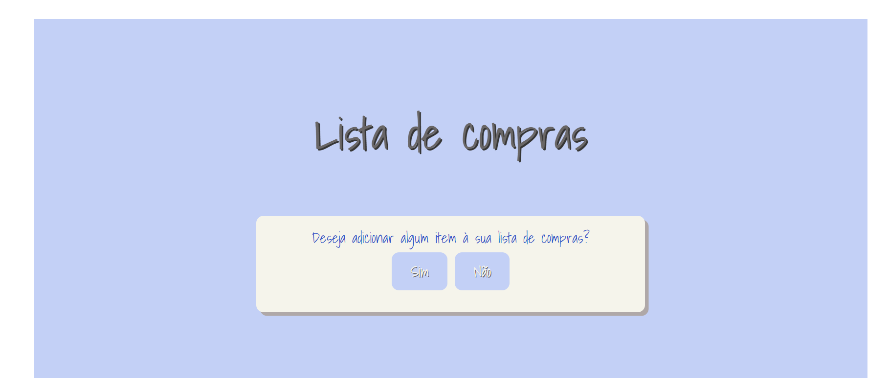

# 7daysOfCode_days5-6_grocery_list

    

This is part of a project of Alura called 7 Days of Code. During 7 consecutive days, each day a new simple project is proposed in the language/framework of choice. 
The goal of this project was develop a grocery list using JavaScript. The user should be able to add and remove list, also dividing them by categories. In the end the user can check the final list or start a new one.  

You can see the code and the final project on this link: https://codepen.io/anast-cia-canto/pen/RwQvPaL

